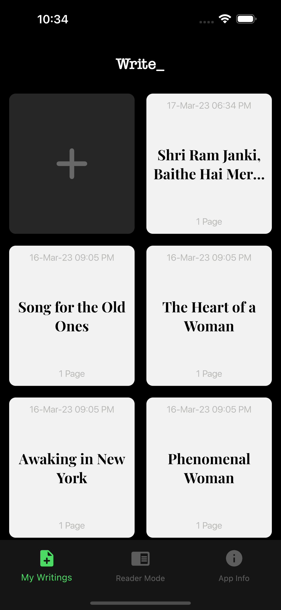
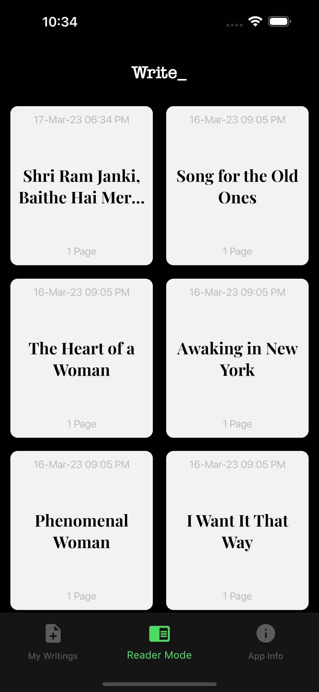
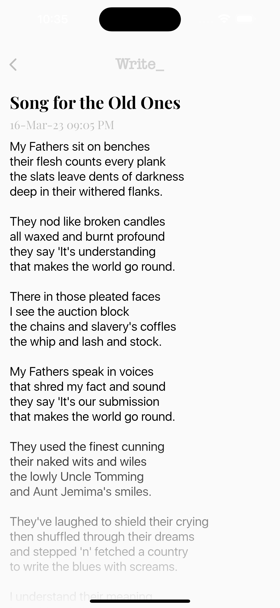
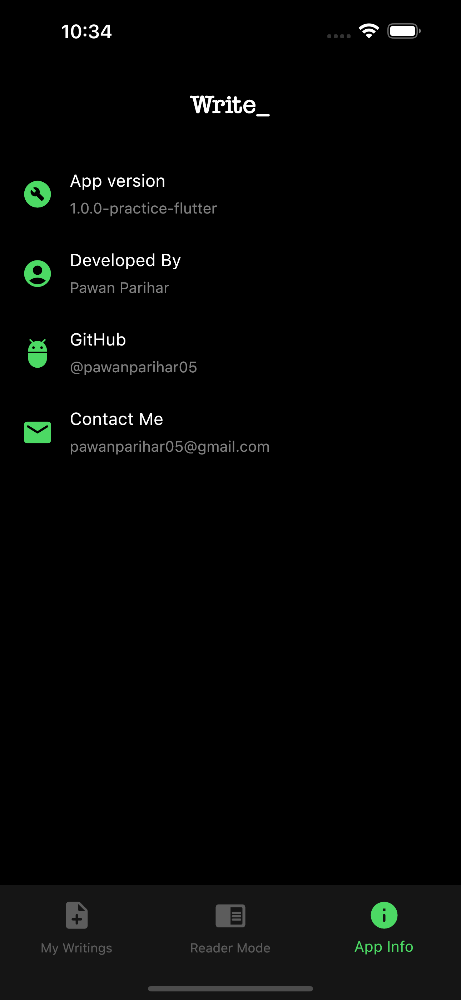

# **Write_**
Simple notes taking cross platform app with minimalistic design.

## **Design**
<a href="https://robertanitei.com/" style= "text-decoration: none;" target="_blank">👍 Robert Anitei</a>
 

## **Flutter Project #1**
I made this project while learning flutter
I hope you like it as much i liked working on it
 

### **Dependencies Used**
*SQFLite*  
*Cupertino Icons*  
*Flutter SVG*  
*Flutter Native Splash*  
 

#### Spread Some ❤️ 

  
 

### **Screenshots**
&nbsp;
&nbsp;
&nbsp;
&nbsp;
&nbsp;
&nbsp;
 

### Find this project useful ? ❤️
* Support it by clicking the ⭐ button on the upper right of this page. ✌️
