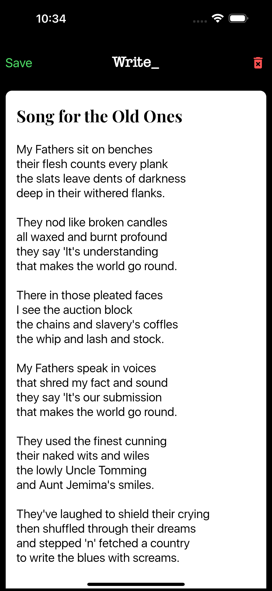

# **Write_**
Notes taking cross platform application built using flutter
 

## **Flutter Project #1**
I made this project while learning flutter
I hope you like it as much i liked working on it
 

### **Dependencies Used**
*SQFLite*  
*Cupertino Icons*  
*Flutter SVG*  
*Flutter Native Splash*  
 

#### Spread Some :heart:

  
 

### **Screenshots**
&nbsp;
&nbsp;&nbsp;
&nbsp;&nbsp;
&nbsp;&nbsp;
&nbsp;&nbsp;
&nbsp;&nbsp;
 

### Find this project useful ? :heart:
* Support it by clicking the :star: button on the upper right of this page. :v:
